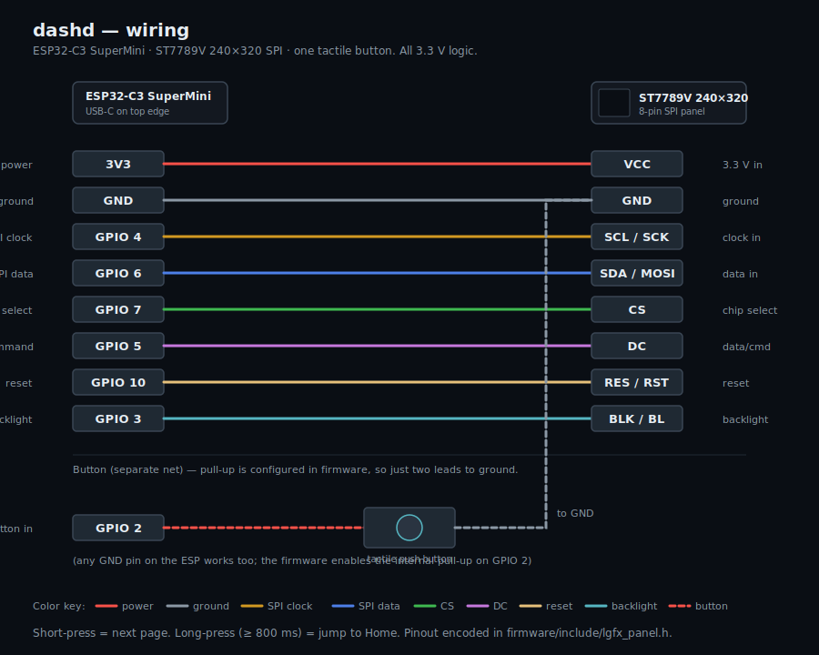
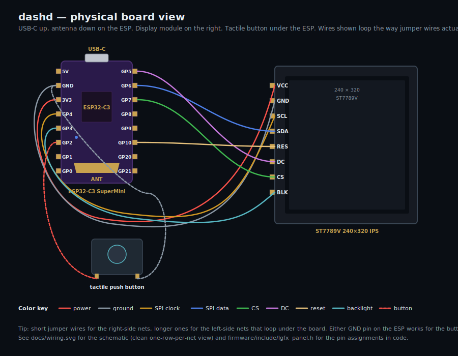

# dashd

Desk widget for developers. A Python agent on your computer collects developer-relevant metrics and streams them to an ESP32-C3 driving a 240×320 ST7789V display — over **USB-CDC serial**, **Bluetooth LE**, or auto-switching between the two. A single tactile button cycles pages.

USB: power + data over one cable. Bluetooth: cable-free, the device runs on any 5 V source. Nothing leaves your machine either way.

## Status

**v0.1.11 — fixes wrong "X/Y" page counter + title/content mismatch on devices with some pages hidden.** See [GitHub Releases](https://github.com/cristianonescu/dashd/releases) for installers (macOS / Windows / Linux) and firmware binaries.

- **Agent** (Python 3.11+): 8 active collectors + 3 stubs (Slack / Teams / WhatsApp), in-process pub/sub bus, local IPC server, transport abstraction over USB-CDC + BLE GATT, ships as a single PyInstaller binary.
- **AI usage accuracy** (v0.1.6+): hybrid pipeline — direct Anthropic OAuth API for Session/Weekly/Sonnet/Extra gauges (opt-in, matches Claude.ai exactly) + local JSONL scan for token counts, cost, per-project breakdown, burn rate. ccusage-style block segmentation; pace metric ("on track / behind / far behind"); LiteLLM-backed per-model pricing with daily refresh.
- **Firmware** (ESP32-C3 + ST7789V via LovyanGFX): 8 pages, host-driven theme + thresholds + page enable mask, USB and BLE links both active, **dual-slot OTA partition layout with SHA256 verification + auto-rollback**, all persisted to NVS across reboots.
- **Bluetooth LE**: cable-free transport built on NimBLE-Arduino + bleak. Pairing with a 6-digit code shown on the device, trusted-device list on the host, auto-reconnect, log/event forwarding identical to USB.
- **Auto-update**: the Electron app self-updates via `electron-updater` (6-hour periodic check + manual via tray menu + Settings → Updates). The **device firmware also updates from the same release page** — the agent downloads the matching `.bin`, streams it over the active USB or BLE link, the device flashes the inactive slot, verifies SHA256, flips the boot pointer, and reboots into the new firmware. Auto-rollback if the new image doesn't come up cleanly.
- **Electron UI**: live view, full settings, VSCode-style dockable logs panel, Connection pane with transport selector + BLE scan/pair/forget flow, contextual hint layer (`data-hint` tooltips on every control), update banner + Settings → Updates pane, autostart, restart, reload config, reset device prefs, drag-to-reorder pages with enable toggle, color-zone editor, text-size sliders per role (title / label / value / big), threshold sliders, brightness, title-bar + footer visibility, screen rotation. Menu-bar / system-tray icon with the same controls + dynamic update menu. App icon shipped.
- **Installers**: `electron-builder` produces DMG (ad-hoc codesigned for Gatekeeper-friendly first launch), NSIS / AppImage / .deb (via the GitHub Actions workflow in `.github/workflows/build.yml`). Silent auto-update works on Windows + Linux; on macOS it falls back to opening the Releases page (Apple Developer ID needed for silent mac updates).

## Wiring

Schematic — one row per connection, follow it top-to-bottom while wiring:



Physical board view — how it looks on the breadboard:



Full pinout table and BOM in [docs/wiring.md](docs/wiring.md).

## Prerequisites

| Tool        | Purpose                            | macOS                                  | Linux                                       | Windows                                     |
|-------------|------------------------------------|----------------------------------------|---------------------------------------------|---------------------------------------------|
| Python 3.11+| Agent runtime                       | `brew install python` (3.14 OK)       | `apt install python3 python3-venv` / `dnf install python3` | [python.org installer](https://www.python.org/downloads/) (tick "Add to PATH") |
| PlatformIO  | Firmware build/flash for ESP32-C3   | `brew install platformio`              | `pipx install platformio` (or `pip install --user`)         | `pip install platformio`                   |
| Node.js 22+ | Electron UI build                   | `brew install node`                    | `apt install nodejs npm` or [nodesource](https://github.com/nodesource/distributions) | [nodejs.org installer](https://nodejs.org/) |
| Git         | Source control                      | `xcode-select --install` or Homebrew   | `apt install git` / `dnf install git`       | [git-scm.com installer](https://git-scm.com/) |

The ESP32-C3 SuperMini uses the built-in USB Serial/JTAG (no CP2102/CH340 driver needed on modern macOS/Linux/Windows). It enumerates with USB **VID `303A`** / **PID `1001`**.

## Build

dashd has three buildable pieces — firmware, Python agent, Electron UI — and a packaged installer that bundles the agent inside the UI.

### Clone

```bash
git clone https://github.com/cristianonescu/dashd.git
cd dashd
```

### Firmware (ESP32-C3)

```bash
cd firmware
pio run                         # compile only
pio run -t upload               # compile + flash (auto-detects the USB port)
pio device monitor -b 115200    # optional: tail device output without the agent
```

The board's native USB Serial/JTAG enters bootloader mode automatically when PlatformIO requests it — no BOOT/RESET button dance. macOS may prompt for permission on the first flash.

### Agent (Python)

```bash
cd agent
python3 -m venv .venv
source .venv/bin/activate                      # Windows: .venv\Scripts\activate
pip install -e '.[dev,net]'                    # all deps incl. network collectors
pytest -q                                       # ~110 tests should pass
```

To produce the **standalone single-binary** (≈22 MB) that the installer bundles:

```bash
pyinstaller dashd-agent.spec --clean
# → agent/dist/dashd-agent  (or dashd-agent.exe on Windows)
```

The binary embeds the matching CPython interpreter and every collector module. End users don't need Python installed.

### UI (Electron + Vite + React + TS)

```bash
cd ui
npm install
npm run build                                  # tsc -p tsconfig.electron.json && vite build
```

Outputs:
- `dist/` — renderer bundle (HTML, CSS, JS)
- `dist-electron/` — compiled main process + preload

### Installers (electron-builder)

After the agent binary AND `npm run build` finish, package the desktop installer for your host OS:

```bash
cd ui
npx electron-builder --mac --arm64       # → release/dashd-<v>-arm64.dmg
npx electron-builder --mac --x64         # → release/dashd-<v>-x64.dmg
npx electron-builder --win               # → release/dashd Setup <v>.exe   (run on Windows)
npx electron-builder --linux             # → release/*.AppImage + .deb     (run on Linux)
```

For **cross-platform installers in one shot**, push a tag and let the GitHub Actions workflow build on all three OSes:

```bash
git tag v0.1.11 && git push --tags        # triggers .github/workflows/build.yml
```

Each runner builds the agent binary for its own OS, builds the UI, runs `electron-builder`, and uploads the installer as a release artifact. Full packaging notes: [docs/packaging.md](docs/packaging.md).

## Run

Three ways to actually use dashd — pick whichever matches what you're doing.

### A. From source (development loop)

Best while you're iterating on collectors or the firmware. Three terminals, one each:

```bash
# 1) Flash the device (only when firmware changes)
cd firmware && pio run -t upload

# 2) Run the agent from source
cd agent && source .venv/bin/activate && python -m dashd -v

# 3) Run the UI in dev mode (live reload)
cd ui && npm run electron:dev
```

The agent prints state pushes + firmware log events to your terminal. The UI window shows the live state and lets you tweak the device with no flashing required.

### B. From the packaged installer (recommended for daily use)

Open the installer for your OS, drag the app into Applications / install via the wizard, then launch **dashd** from your launcher.

On first launch dashd asks once: *"Start dashd at login? Yes / Not now."*
- **Yes** → the agent is installed as a launchd LaunchAgent (macOS), systemd-user unit (Linux), or HKCU\Run entry (Windows) and starts on every login.
- **Not now** → the agent only runs while the app is open.

You can change this any time from **Settings → General → Start at login**.

The agent runs in the background; closing the app window hides it but the menu-bar / system-tray icon keeps you in control:

```
🟢 Agent running
🟢 Device connected
─────────────────────
Show window / Hide window
Restart agent
Reload config
☐ Start at login
─────────────────────
Quit dashd
```

### C. Headless (agent only, no UI)

If you don't want the Electron app — just the agent pushing to the device:

```bash
# Foreground
dashd                           # entry-point installed by `pip install -e`
# or
./dist/dashd-agent              # the PyInstaller single-binary

# Background (macOS, manual launchd install)
cp packaging/ro.softwarechef.dashd.agent.plist ~/Library/LaunchAgents/
launchctl bootstrap gui/$(id -u) ~/Library/LaunchAgents/ro.softwarechef.dashd.agent.plist
```

Subscribe to the agent's local IPC server (TCP `127.0.0.1:52317`) to consume the same JSON state frames the device gets — useful for scripting / other widgets. See [docs/ipc.md](docs/ipc.md).

## Connecting the device

dashd talks to the ESP32 over one of three transports, selected in **Settings → Connection** (or `[transport].mode` in `config.toml`, or the `DASHD_TRANSPORT` env var):

| Mode        | Behavior |
|-------------|----------|
| `cable`     | USB-CDC serial only. Fastest, no pairing. |
| `bluetooth` | BLE GATT only. No cable required — the device just needs 5 V power. |
| `auto`      | USB when a dashd device is plugged in, BLE otherwise. **Recommended.** |

Switching modes restarts the agent so the new transport is picked up.

### Bluetooth pairing

The first time you connect to a device over BLE you'll be asked to confirm a code:

1. Power the device (any USB-C source works — wall brick, power bank, the host).
2. Open **Settings → Connection → Bluetooth devices → Scan**.
3. Click **Pair** next to the device you want. A 6-digit code shows on the device's screen — and is also surfaced in the Logs panel and the Connection pane itself.
4. Type the code, click **Pair**. The agent stores a trust token under `~/.config/dashd/ble_trust.json` (mode 0600); future connects to that device skip the code.
5. To revoke trust, **Settings → Connection → Paired devices → Forget**.

Trusted-device storage and the on-device pairing protocol are documented in [docs/protocol.md](docs/protocol.md).

### Logs panel

Logs live in a VSCode-style dockable panel at the bottom of the window, toggled via the **Logs ▴** button at the bottom-right corner. It overlays whichever tab is active (Live or Settings), so you can watch agent + firmware logs while tweaking settings or watching the live view. Filter by level (all / info / warn / error); the panel keeps the last 1000 lines and auto-scrolls when you're at the bottom.

## Auto-update

Both the desktop app and the device firmware update from the same GitHub Releases page. Each one is its own prompt — you can defer one without affecting the other.

### App

The app checks GitHub Releases on launch and then every 6 hours. When a newer release is found:

- A banner appears in the top-right corner: *"dashd v0.1.11 available — Download"*.
- The tray icon's right-click menu adds **▾ v0.1.11 available → Download update**.
- **Settings → Updates** has the full picture: current version, last-check timestamp, release notes, Download / Restart-and-install / Open release page.

Downloads run in the background; the new version installs on the next quit (or right away if you click **Restart and install**).

**macOS caveat:** the unsigned-by-Apple-Developer builds are accepted by Gatekeeper after a one-time *"identified developer cannot be verified"* click-through, but `electron-updater`'s Squirrel.Mac path won't silently install updates against them. When Squirrel reports a code-signature error, dashd falls back to opening the GitHub release page in your browser — you download the new DMG and replace the app manually. Once we sign with a paid Apple Developer ID, silent updates work like on Linux + Windows.

### Device firmware

Pre-flight checklist:
- Device must be powered and connected (USB or BLE — whichever transport is active).
- One-time-only: if upgrading from v0.1.1, the partition layout changed in v0.1.2 (single-app → dual-slot OTA). v0.1.1 firmware can't OTA to v0.1.2 — flash once via USB with `pio run -e dashd_ble -t upload`. From v0.1.2 onwards, OTA works.

The flow:

1. Open **Settings → Updates → Device firmware → Check for updates**.
2. If a newer firmware is published, the card shows the version + release notes.
3. Click **Update firmware**. Confirm the dialog.
4. Agent downloads the matching `.bin` from GitHub (`-ble.bin` if the device is on Bluetooth, `-usb.bin` over the cable), computes the SHA256, and streams it in ~2 KB chunks to the inactive OTA slot. Each chunk is ACK'd by the device for flow control.
5. The device shows a fullscreen progress overlay (version transition, big progress bar, KB counter, *"do not unplug"* warning). Same data also surfaces in the Electron logs panel.
6. After the last chunk, the device re-verifies the SHA256 against the host-provided hash, flips the boot pointer, and reboots into the new slot.
7. If the new firmware fails to send its first `boot` event within 30 s after reset, the ESP-IDF bootloader rolls back to the previous slot automatically — your device cannot be bricked by a bad image.

Over USB, the whole transfer takes a few seconds. Over BLE, expect 1–3 minutes (GATT writes at ~10 KB/s).

If anything goes wrong, the card shows the error and the previous firmware keeps running — you can retry, or unplug + replug to start fresh.

## Deploy

### To your own machine

1. Build the installer for your OS (see *Build* above) **or** download the artifact from the GitHub Actions workflow run.
2. Run the installer (`dashd-<version>-<arch>.dmg`, `.exe`, `.AppImage`, or `.deb`).
3. First launch: opt in to autostart if you want it.
4. Set the network-collector env vars (next section) and reload config from Settings.

### To other users

Tagged releases go through the CI workflow:

```bash
# In your local clone
git tag v0.2.0
git push --tags
# → .github/workflows/build.yml runs a firmware (esp32-c3) job + per-OS
#   matrix (macos-14 cross-builds arm64+x64, windows-latest, ubuntu-latest).
#   Installers + firmware bins attach to a draft GitHub Release.
```

Promote the draft release to published when you've smoke-tested the artifacts. Users with an older dashd installed get the update automatically via `electron-updater` (configured to read from the same GitHub Releases endpoint).

### Production notes

- **Unsigned v1.** macOS Gatekeeper / Windows SmartScreen will warn on first launch:
  - macOS: right-click the app → Open → confirm. Once accepted, future launches are silent.
  - Windows: SmartScreen "More info" → Run anyway.
  - Both workarounds documented in [docs/packaging.md](docs/packaging.md). To remove the warnings, sign with an Apple Developer cert + Windows code-signing cert and re-build — `electron-builder.yml` has hooks for both.
- **Run-at-login** is per-user, off by default. Toggled live from Settings → General; writes a launchd plist / systemd unit / Run-key entry under the user's home, never anything system-wide.
- **Secrets** (GitHub PAT, IMAP app password) stay in environment variables — they never enter `config.toml` or git. See *Network collector setup* below.
- **Update channel.** `electron-updater` checks GitHub Releases at every launch. To disable, comment out the `publish:` block in `ui/electron-builder.yml`.
- **Multiple machines.** The agent owns TCP port `52317` per host; a second dashd-agent on the same machine refuses to start (port-busy guard). Different machines are fully independent — each has its own device, agent, and `~/.config/dashd/` state.

## Layout

```
dashd/
├── agent/         # Python agent (collectors, transports, IPC server)
│   ├── dashd/transport/  # USB-CDC + BLE GATT links + base interface
│   └── dashd-agent.spec  # PyInstaller bundle spec
├── firmware/      # ESP32-C3 PlatformIO project (LovyanGFX + ArduinoJson + NimBLE)
│   └── src/       # usb_link.cpp, ble_transport.cpp, pages, pet, transitions
├── ui/            # Electron + Vite + React + TS desktop app
│   ├── electron/  # main process (supervisor, IPC client, autostart)
│   └── src/       # renderer (React) — ConnectionPane, LogsPanel, HintLayer, …
└── docs/          # Wiring, protocol, setup guides, IPC, packaging
```

## Pages

| # | Page     | Sources                          |
|---|----------|----------------------------------|
| 1 | Home     | Live tiles: CPU, RAM, AI $, git, PRs, msgs |
| 2 | System   | `psutil` — CPU/core, RAM, disk, net, battery, CPU temp |
| 3 | AI Spend | Claude Code (tokens + cost + 5h block) and Codex (block %) |
| 4 | Dev Flow | Branch, commits today, ±LOC, time since last commit |
| 5 | GitHub   | PRs awaiting your review, CI failures (24h), unread notifications |
| 6 | Calendar | Countdown to next event, title, remaining events today |
| 7 | Messages | Email + iMessage + (stubs for Slack/Teams/WhatsApp) |
| 8 | Tips     | Real-time advice (close-this-app / slow-down-claude / battery-low) + top processes by CPU and RAM |

Short-press the button to advance one page; long-press to return to Home. Page swaps are animated — **forward** (short-press, host `show_page`) plays a horizontal wipe with the pet running ahead of the new page; **home** (long-press) plays a centre zoom with the pet jumping in the middle. The 5h block on AI Spend mirrors Anthropic's rolling rate-limit window; cost is computed from a vendored snapshot of [LiteLLM's pricing catalog](https://github.com/BerriAI/litellm) (see [agent/dashd/pricing/](agent/dashd/pricing/) — refreshed daily over httpx, overridable per-model via `[collectors.claude_code.rates]` in `config.toml`).

### Pet overlay

A small animated pet sits on every page (default **bottom-right** corner, toggleable from Settings → Pet). The agent reacts to your activity:

| Trigger | Pet animation |
|---|---|
| New commit since last tick | `wave` |
| CI failure appeared | `failed` |
| Meeting in ≤ 5 min | `jump` |
| AI 5h block ≥ 75 % | `review` |
| RAM ≥ 92 % or CPU ≥ 80 % | `running` |
| Nothing happening for > 60 s | `waiting` |
| Otherwise | `idle` |

The default pet is **Claw'd** (creator: krrsantan, [source](https://codexpets.net/gallery/claw-d)), embedded directly into the firmware as RGB565 frames (no download needed on first use, full attribution in Settings → Pet).

Swap pets from **Settings → Pet → Catalog**: the agent fetches the full codexpets.net catalog from its public sitemap into a lazy-scrolled list, downloads + converts + streams the bundle to the device, and stores it in the on-device LittleFS partition. Direct slug or URL entry works too (`pixel-coder` or `https://codexpets.net/gallery/pixel-coder`). The active pet survives reboots; switching back to the default is one click.

## Network collector setup

Set these env vars (or paste secrets into `~/.config/dashd/config.toml`, less safe):

```bash
export GITHUB_TOKEN=ghp_...                      # PAT with `repo` + `notifications`
export DASHD_EMAIL_PASSWORD='app-password-here'  # Gmail app password for IMAP
```

For Microsoft Graph Calendar, follow [docs/microsoft-graph-setup.md](docs/microsoft-graph-setup.md) once to get `client_id` + `tenant_id`. First run prints a device-code URL — sign in once, the refresh token caches to `~/.config/dashd/msgraph_token.json` (mode 0600).

### AI usage tuning

dashd's AI usage display has two data pipelines:

1. **Anthropic OAuth API** (opt-in, v0.1.6+). When enabled, dashd reads your local Claude Code OAuth token and calls Anthropic's usage endpoint directly. Session % / Weekly % / Sonnet % / Extra-usage match Claude.ai exactly because they ARE Claude.ai's numbers. Toggle in **Settings → Privacy → "Enable Anthropic OAuth Usage API"** (default off).
2. **Local JSONL scan** (always on). Reads `~/.claude/projects/**/*.jsonl` to derive token counts, cost, per-project breakdowns, burn rate. Includes cache reads — token numbers will be larger than Claude.ai's plan-unit gauges, which is correct: the cost is real, the percentages are different metrics.

The two pipelines coexist on the wire. The new `anthropic` block is additive — UI prefers it for gauges, falls back to JSONL when the OAuth pipeline is disabled or unreachable.

| Env var / config key | Effect |
|---|---|
| `DASHD_ANTHROPIC_OAUTH=1` *(or `[collectors.anthropic_oauth] enabled = true`, or Settings → Privacy)* | Enable the Anthropic OAuth Usage API pipeline. Default off. Toggling restarts the agent so the env var takes effect. |
| `DASHD_CLAUDE_BLOCK_BUDGET=1500000` *(or `[collectors.claude_code] block_token_budget = 1500000`)* | Unlocks `block_used_pct` (real quota %) and the "hits cap in N min" burn-rate projection on the AI Spend page. Without it, only the time-elapsed metric (`block_elapsed_pct`) is shown. |
| `CLAUDE_CONFIG_DIR=/path1,/path2,…` | Override Claude Code's project-data location. Comma-separated, all scanned. Defaults to `$XDG_CONFIG_HOME/claude` then `~/.claude`. |
| `DASHD_TRANSPORT={cable\|bluetooth\|auto}` | Pick the device link. Defaults to `auto`. The Electron app sets this for you via Settings → Connection. |

The agent persists Codex's cumulative-delta state at `~/.config/dashd/codex_state.json` and a cached LiteLLM pricing snapshot at `~/.config/dashd/litellm-pricing.cache.json` (refreshed daily via httpx; falls back to the bundled snapshot silently on failure). Both are safe to delete — they're rebuilt on next collect.

### Tray popover + Usage tab (v0.1.6+)

Click the dashd tray/menu-bar icon — a frameless popover opens at the icon with Session, Weekly, Sonnet, Extra-usage gauges plus today/last-7-days cost (codexbar-style at-a-glance). Right-click still shows the full context menu (restart, autostart, quit, etc.).

The main window gains a **Usage** tab between Live and Settings: same gauges at the top, plus dashd-only deep-dive sections (cost & tokens by window, top projects today, per-model breakdown, Codex stats).

## Troubleshooting

**`python -m dashd` says "no matching serial device"**
The agent scans `pyserial`'s port list for VID `0x303A` / PID `0x1001`. List what your OS sees:

```bash
python -c "from serial.tools.list_ports import comports
for p in comports(): print(p.device, hex(p.vid or 0), hex(p.pid or 0), p.description)"
```

If the VID/PID differ, override the port in `~/.config/dashd/config.toml`:

```toml
[serial]
port = "/dev/tty.usbmodem01"
```

or via env var: `DASHD_SERIAL_PORT=/dev/tty.usbmodem01 python -m dashd`.

**Display is black**
Check the BLK wire to GPIO 3 — the firmware drives it HIGH on boot. Verify the SPI pinout against [docs/wiring.md](docs/wiring.md).

**`pio run -t upload` fails to find a port**
Unplug and replug. If still missing, check `ls /dev/tty.usbmodem*` (macOS) or `ls /dev/ttyACM*` (Linux). On Linux, your user may need to be in the `dialout` group (`sudo usermod -aG dialout $USER && newgrp dialout`).

**Firmware compiles but the display shows garbage**
SPI clock is 40 MHz in [include/lgfx_panel.h](firmware/include/lgfx_panel.h). Drop `freq_write` to 27 MHz if you see corruption; some unbranded ST7789V panels can't keep up.

**Colors are inverted (background looks light)**
Toggle `cfg.invert` in `lgfx_panel.h` — ST7789V variants differ.

**I want to see firmware logs**
The agent prints them: any `usb_log(...)` call from the firmware arrives as a `{"type":"event","name":"log","level":...,"msg":...}` line over the same USB-CDC port and renders through `dashd.fw` at the matching log level. Run `dashd -v` to include debug logs.

For raw `pio device monitor`, stop the agent first — macOS lets only one process own the CDC port at a time.

**Agent shows live data but the screen doesn't update**
The firmware shows a "host disconnected" (red ×) indicator if it hasn't received a state message in 10 s. Check `pio device monitor` for parse errors.

**Bluetooth: Scan finds nothing**
The device only advertises while no host is connected to it. If the cable is plugged in *and* `[transport].mode = "auto"`, the agent is already attached over USB and BLE advertising is suppressed — unplug it (or set mode to `bluetooth`) and scan again. On macOS, also confirm Bluetooth is on under System Settings and that the dashd app has been granted Bluetooth permission (System Settings → Privacy & Security → Bluetooth) — first scan triggers the prompt.

**Bluetooth: "Pairing failed"**
Most often the 6-digit code timed out (≈30 s). Click **Pair** again; a fresh code appears on the device. If the device is paired with a different host (the macOS Bluetooth menu shows it as "Connected"), unpair it there first — the dashd link is in-band, not OS-level Bluetooth.

**Bluetooth: keeps reconnecting / drops every few seconds**
Run `dashd -v` and watch the Logs panel for `ble`-prefixed lines. RSSI under −80 dBm usually means range or interference; move the device closer or restart it. If logs show repeated `trust check failed`, the device's NVS lost the trust token (e.g. you re-flashed firmware) — click **Forget** for that address and re-pair.

## Protocol

See [docs/protocol.md](docs/protocol.md). Newline-delimited UTF-8 JSON, shared between transports: USB-CDC runs at 460800 baud; BLE wraps the same JSON in a write-without-response GATT characteristic plus a notify characteristic for state/event traffic.

## Collectors

See [docs/collectors.md](docs/collectors.md) for a per-collector reference: data sources, fallback behavior, and known caveats (e.g. Codex JSONL doesn't expose per-call token counts, only block %).

## License

MIT — see [LICENSE](LICENSE).
